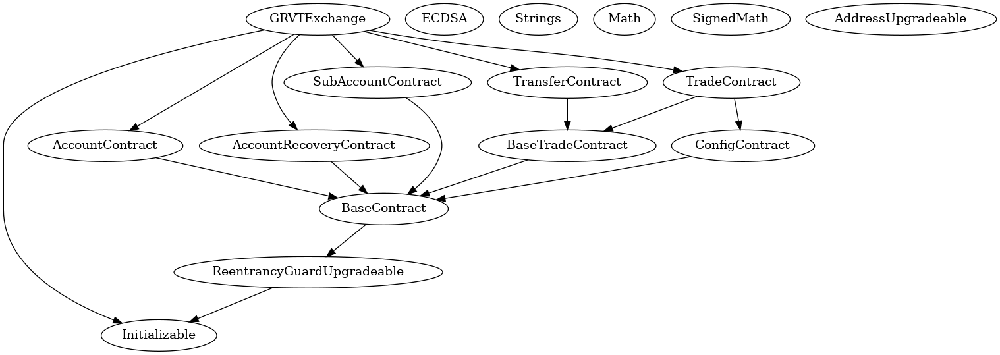

# GRVT Exchange Smart Contract

## Project Layout

- `/contracts`: Contains solidity smart contracts.
- `/deploy`: Scripts for contract deployment and interaction.
- `/test`: Test files.
- `hardhat.config.ts`: Configuration settings.

## Dependencies

- `npm install -g surya`: Install [Consensys Surya](https://github.com/ConsenSys/surya?tab=readme-ov-file) for static analysis of code like drawing inheritance graph. (Optional)
- Install [Era Test Node](https://docs.zksync.io/build/test-and-debug/era-test-node.html#understanding-the-in-memory-node). To test your installation, run `era_test_node run`.

## How to Use

- `era_test_node run`: Run zkSync Era In-memory node locally (an alternative is to run `yarn hardhat node-zksync`).
- `yarn compile`: Compiles contracts.
- `yarn deploy:upgradable`: Deploys `GRVTExchange.sol` using the [transparent proxy pattern](https://blog.openzeppelin.com/the-transparent-proxy-pattern).
- `yarn test`: Tests the contracts.

## Static Analysis

- `yarn draw`: draw the inherittance graph using the surya consensys module
  

### Environment Settings

To keep private keys safe, this project pulls in environment variables from `.env` files. Primarily, it fetches the wallet's private key.

Rename `.env.example` to `.env` and fill in your private key:

```
WALLET_PRIVATE_KEY=your_private_key_here...
```

### Network Support

Modify networks in `hardhat.config.ts` using the `networks` section. Set a default with `defaultNetwork` or use `--network`, e.g., `hardhat test --network dockerizedNode`.

## Notes

This project was scaffolded with [zksync-cli](https://github.com/matter-labs/zksync-cli).
