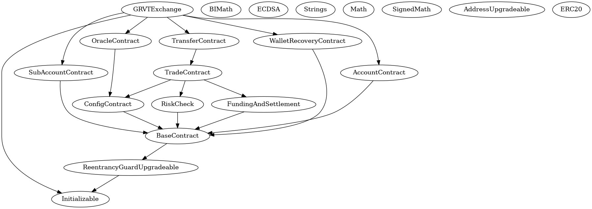

# GRVT Exchange L2 Smart Contract

## Project Layout

This project is based on Foundry(Ethereum) + Hardhat(Zksync). Foundry is used mostly for unit testing while hardhat is used for testing, scripting and deployments. We use the [hardhat-foundry](https://hardhat.org/hardhat-runner/plugins/nomicfoundation-hardhat-foundry) plugin to support both frameworks.

- `/contracts`: Contains solidity smart contracts.
- `/deploy`: Scripts for contract deployment and interaction.
- `/test`: Test files. Files tested using foundry are under `test/foundry`
- `hardhat.config.ts`: Configuration settings.

## Dependencies

- `curl -L https://foundry.paradigm.xyz | bash` and `foundryup` to install foundry
- `npm install -g surya`: Install [Consensys Surya](https://github.com/ConsenSys/surya?tab=readme-ov-file) for static analysis of code like drawing inheritance graph. (Optional)
- Install [Era Test Node](https://docs.zksync.io/build/test-and-debug/era-test-node.html#understanding-the-in-memory-node). To test your installation, run `era_test_node run`.

## How to Use

- `era_test_node run`: Run zkSync Era In-memory node locally (an alternative is to run `yarn hardhat node-zksync`).
- `yarn compile`: Compiles contracts.
- `yarn deploy:upgradable`: Deploys `GRVTExchange.sol` using the [transparent proxy pattern](https://blog.openzeppelin.com/the-transparent-proxy-pattern).
- `yarn test`: Tests the contracts using both forge and harhat.

## Static Analysis

- `yarn draw`: draw the inherittance graph using the surya consensys module
  

### Environment Settings

To keep private keys safe, this project pulls in environment variables from `.env` files. Primarily, it fetches the wallet's private key.

Rename `.env.example` to `.env` and fill in your private key:

```
WALLET_PRIVATE_KEY=your_private_key_here...
```

### Network Support

Modify networks in `hardhat.config.ts` using the `networks` section. Set a default with `defaultNetwork` or use `--network`, e.g., `hardhat test --network dockerizedNode`.

### Deployment
To deploy the smart contract, run `yarn deploy:upgradable --network <networkName>` with networkName defined in `hardhat.config.ts`

## Notes

This project was scaffolded with [zksync-cli](https://github.com/matter-labs/zksync-cli).

## Important Temporary Note

### How to Access `era_test_node` with Contracts Larger Than the Limit

The current version of `era_test_node` supports a maximum contract size of 28kb. However, our contracts can be as large as 40kb. To test contracts of this size, you need to run tests against a specific version of `era_test_node` temporarily that supports Validiums.

You can use [this branch](https://github.com/matter-labs/era-test-node/tree/dz-free-pubdata) until we create a separate flag for validium mode.

To utilize this branch:

1. Build the `era_test_node` with:

   ```
   cargo build --release
   ```

2. Run it as an executable:
   ```
   ./target/release/era_test_node run
   ```
